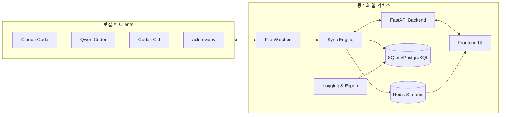

# AI Client 동기화 서비스 아키텍처 및 기술 스택

본 문서는 로컬 AI Client 동기화 서비스를 구축하기 위한 목표 아키텍처와 권장 기술 스택을 정리한다. 요구사항은 로컬 설치 가능한 웹 서비스, 실시간 동기화 상태 모니터링, 로그 관리 및 내보내기 기능, 확장 가능한 구조를 포함한다.

## 1. 아키텍처 개요

주요 구성 요소:
- **File Watcher**: 각 클라이언트의 MCP/Rule/Allowed-tools 설정 디렉터리를 감시하고 변경 이벤트를 발생시킨다.
- **Sync Engine**: 변경 이벤트를 수집하여 공통 스키마로 파싱하고, 충돌 정책을 적용해 중앙 저장소(DB)에 반영하며 각 클라이언트에 변경 사항을 전파한다.
- **API Backend (FastAPI)**: 동기화 제어, 상태 조회, 설정 관리, 로그 조회/내보내기 API를 제공한다.
- **Frontend UI (React + Vite)**: 실시간 동기화 상태, 로그, 경고를 시각화하고 수동 동기화/롤백 기능을 제공한다.
- **Message Broker (Redis Streams)**: 실시간 이벤트를 프런트엔드로 push하고 향후 확장을 위한 비동기 파이프라인을 제공한다.
- **Database**: 설정 스냅샷, 이벤트 이력, 동기화 충돌 정보를 저장한다.

## 2. 기술 스택 선정

| 영역 | 선택 | 사유 |
| --- | --- | --- |
| Backend | **FastAPI** | 비동기 지원, 타입 힌트 기반 문서화, Pydantic과의 긴밀한 통합으로 설정 스키마 검증 용이 |
| Frontend | **React + Vite + TypeScript** | 빠른 개발 사이클, 풍부한 컴포넌트 생태계, 상태 관리 라이브러리 연동 용이 |
| Database | **SQLite (초기) / PostgreSQL (확장)** | 단일 머신 설치 용이, 향후 다중 인스턴스나 동시성 요구 시 PostgreSQL로 이관 |
| Message Broker | **Redis Streams** | 가벼운 의존성, 실시간 이벤트 전달 및 백프레셔 처리 용이 |
| File Watcher | **watchfiles (Python)** | 크로스 플랫폼, FastAPI와 동일 런타임에서 실행 가능 |
| Logging | **structlog + loguru + OpenTelemetry Exporter (optional)** | 구조화 로그, JSON 출력, 외부 APM 연동 확장성 |
| Packaging | **Poetry / uv** | 멀티 환경 의존성 관리 및 배포 파이프라인 단순화 |
| Testing | **pytest + pytest-asyncio + Playwright (프런트엔드)** | 비동기 백엔드 테스트 및 E2E UI 검증 |
| CI/CD | **GitHub Actions** | lint/test/빌드 자동화, 릴리스 파이프라인 구성 |
| Containerization | **Docker + docker-compose** | 로컬 개발/배포 환경 일관성 확보 |

## 3. 요구사항 대응 전략

- **로컬 설치형**: Docker Compose 템플릿과 설치 스크립트를 제공하여 FastAPI, Redis, SQLite/PostgreSQL, React UI를 단일 머신에서 쉽게 구동.
- **실시간 모니터링**: File Watcher → Redis Streams → Frontend(WebSocket/SSE) 경로를 통해 이벤트를 즉시 전파하고 UI에서 상태를 갱신.
- **로그 관리 및 Export**: 구조화 로그를 DB와 파일에 동시에 저장하고 CSV/JSON Export API 제공. 선택적으로 OpenTelemetry Exporter를 통해 외부 관측 플랫폼으로 연동.
- **확장성**: Sync Engine과 API를 모듈화하여 향후 다중 노드 지원 시 Redis Streams와 PostgreSQL을 중심으로 스케일 아웃 가능.

## 4. 보안 및 운영 고려

- 로컬 인증: API 및 UI 접근 시 토큰 기반 인증(예: OAuth2 password flow) 또는 OS 계정 연동.
- 비밀 관리: `.env.example` 템플릿과 `sync_service.secrets` CLI를 사용해 OS Keyring에 API 토큰/관리자 비밀번호를 안전하게 저장.
- 감사 로그: 동기화 작업 및 사용자 액션을 모두 기록하여 감사 추적 가능.
- 백업 전략: 설정 스냅샷과 이벤트 로그를 주기적으로 백업하고 Import/Export 워크플로 제공.

## 5. 향후 확장 포인트

- 에이전트 추가: 새로운 AI 클라이언트가 등장해도 커넥터 플러그인을 추가하면 동기화 파이프라인을 재사용할 수 있는 구조.
- 협업 기능: 멀티 사용자 지원 및 역할 기반 접근 제어(RBAC) 도입.
- 분석 대시보드: 동기화 성공률, 평균 지연 등 지표를 시각화.
- 클라우드 모드: 로컬 배포 외에도 경량 클라우드 인스턴스에 동일 스택을 배포할 수 있도록 Helm chart 등 제공.
