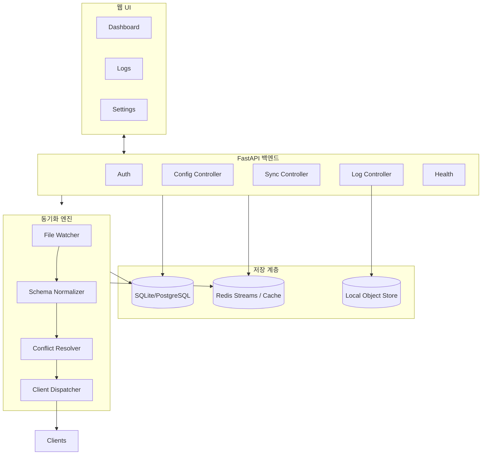
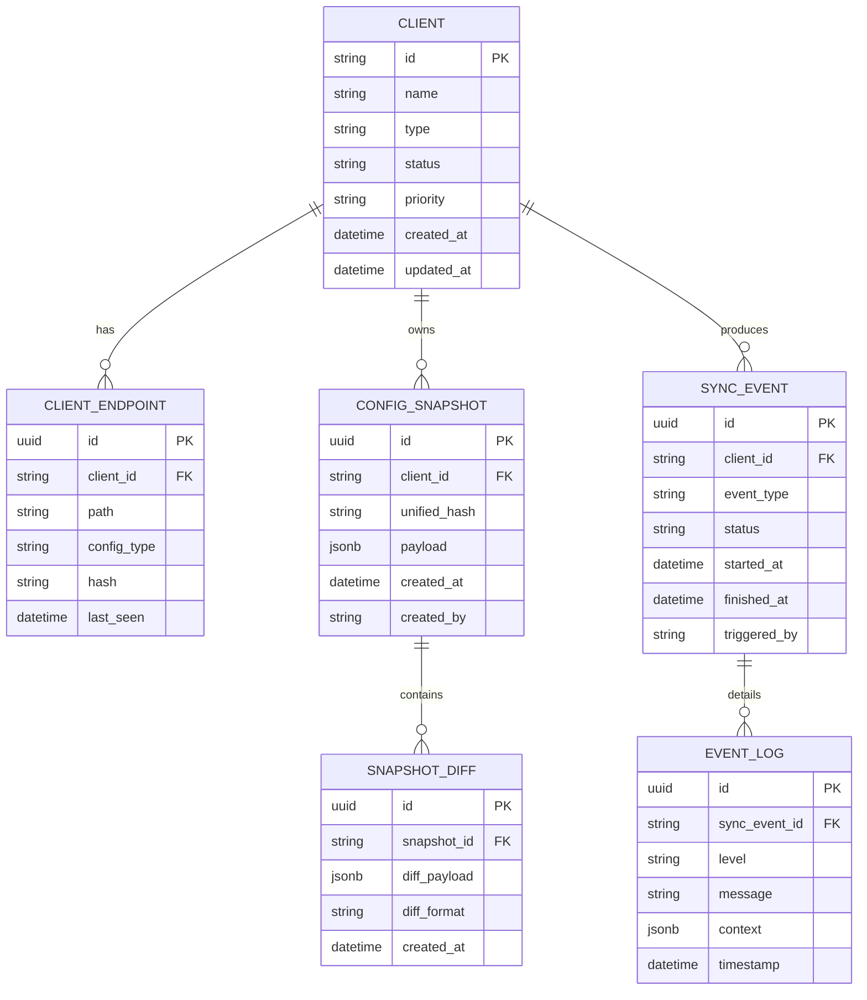
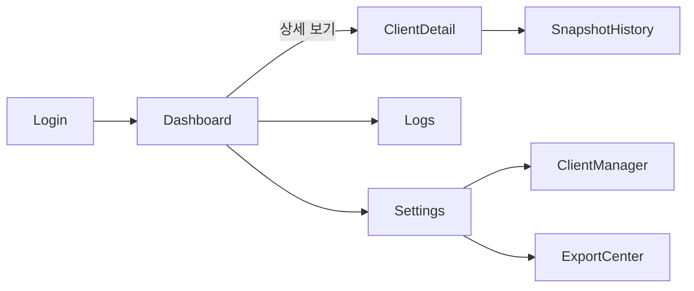

# AI Client 동기화 서비스 설계 문서

본 문서는 동기화 서비스의 시스템 구성, 데이터 모델, UI 흐름, 동기화 로직을 상세히 정의한다. 설계는 SDD(Scenario/Software Design Document) 원칙에 따라 구조와 시나리오를 명확히 기술한다.

## 1. 시스템 설계

### 1.1 컴포넌트 다이어그램



### 1.2 데이터 플로우

1. File Watcher가 각 클라이언트의 설정 디렉터리를 감시한다.
2. 변경 이벤트 발생 시 Normalizer가 공통 스키마(`UnifiedConfig`)로 파싱한다.
3. Conflict Resolver가 최신 스냅샷과 비교하여 충돌 정책(우선순위/타임스탬프/사용자 선택)을 적용한다.
4. 업데이트된 설정은 DB에 스냅샷으로 저장되고 Dispatcher를 통해 다른 클라이언트 설정 파일에 반영된다.
5. 이벤트는 Redis Streams로 publish되어 UI가 실시간으로 구독한다.
6. API는 상태 조회, 수동 동기화 요청, 롤백, 로그 다운로드 등을 제공한다.

### 1.3 API 설계(요약)

| API | Method | 설명 |
| --- | --- | --- |
| `/api/v1/auth/token` | POST | 사용자 인증 및 액세스 토큰 발급 |
| `/api/v1/config/snapshots` | GET | 최신 스냅샷 목록 및 메타데이터 조회 |
| `/api/v1/config/apply` | POST | 수동으로 특정 스냅샷을 대상 클라이언트에 적용 |
| `/api/v1/sync/status` | GET | 각 클라이언트별 동기화 상태, 마지막 동기화 시간, 오류 정보 |
| `/api/v1/sync/trigger` | POST | 즉시 동기화를 실행 |
| `/api/v1/logs` | GET | 로그 필터링 및 페이지네이션 조회 |
| `/api/v1/logs/export` | POST | CSV/JSON 등 포맷으로 로그 내보내기 |
| `/api/v1/clients` | GET | 연결된 클라이언트 목록, 버전, 지원 기능 |
| `/api/v1/clients/{id}` | PATCH | 특정 클라이언트 설정(활성화, 우선순위 등) 업데이트 |
| `/healthz` | GET | 서비스 헬스 체크 |

### 1.4 환경 구성 및 비밀 관리

- `.env.example` 템플릿을 통해 FastAPI/Redis/DB 기본 값을 정의하고, 배포 환경에 맞춰 `.env`에서 손쉽게 재정의한다.
- 민감한 자격 증명(API 토큰, 관리자 비밀번호 등)은 keyring 기반 `sync_service.secrets` 헬퍼로 관리한다.
  - `python -m sync_service.secrets set <alias>` 명령으로 값을 저장하고, `check` 서브커맨드로 필수 비밀 존재 여부를 검사한다.
  - 애플리케이션은 `Settings.secret_service_name`과 프리셋 키(`api_token_key`, `admin_password_key`)를 사용해 런타임에 비밀을 조회한다.

## 2. 데이터베이스 설계

### 2.1 ERD



### 2.2 테이블 스키마 요약

- **CLIENT**: 클라이언트별 메타데이터와 우선순위 관리.
- **CLIENT_ENDPOINT**: MCP/Rule/Allowed-tools 파일 경로와 해시 관리.
- **CONFIG_SNAPSHOT**: 통합 설정 스냅샷 저장(`payload` 컬럼에 JSON 저장).
- **SNAPSHOT_DIFF**: 이전 스냅샷과 비교한 변경 diff 저장.
- **SYNC_EVENT**: 동기화 실행 단위, 상태, 시간 기록.
- **EVENT_LOG**: 구조화 로그 메시지와 컨텍스트 보관.

## 3. UI/UX 설계

### 3.1 화면 플로우



### 3.2 주요 와이어프레임 개요

1. **대시보드**: 클라이언트별 동기화 상태 카드, 최근 이벤트 타임라인, 경고 배너.
2. **클라이언트 상세**: 대상 파일 경로, 마지막 스냅샷 비교, 수동 동기화 버튼.
3. **로그 뷰어**: 수준(Level) 필터, 검색, 페이지네이션, Export 버튼.
4. **설정/관리**: 클라이언트 등록/비활성화, 우선순위 조정, 백업/복원 실행.
5. **Export Center**: 로그/스냅샷 내보내기 히스토리, 다운로드 링크.

## 4. 동기화 로직 설계

### 4.1 동기화 알고리즘(의사코드)

```
loop watch_event in file_watcher:
    normalized = normalize_to_unified_schema(watch_event)
    current_snapshot = load_latest_snapshot(normalized.client_id)
    conflict = detect_conflict(current_snapshot, normalized)
    if conflict.exists:
        resolution = resolve_conflict(conflict, policy)
        if resolution.action == "manual":
            enqueue_manual_intervention(conflict)
            continue
        normalized = resolution.payload
    new_snapshot = save_snapshot(normalized)
    diff = compute_diff(current_snapshot, new_snapshot)
    record_event(event_type="update", status="success", diff=diff)
    propagate_to_targets(new_snapshot, targets=resolution.targets)
    notify_realtime(new_snapshot, diff)
```

### 4.2 충돌 해결 전략

- **우선순위 기반**: 사전에 정의한 클라이언트 우선순위로 승자 결정.
- **최신 타임스탬프**: 수정 시간이 가장 최근인 변경을 우선 적용.
- **사용자 개입**: 자동 규칙이 충돌을 해결하지 못할 경우 UI로 알림을 보내고 사용자 수동 선택을 기다림.
- **3-Way Merge**: Git-style diff를 적용해 자동 병합 가능 시 수행.

### 4.3 에러 핸들링

- 파일 접근 실패 시 재시도 정책(Exponential Backoff) 적용 후 실패 로그 기록.
- Sync Engine 내부 예외는 Sentry/OpenTelemetry로 전송하고 사용자에게 경고 표시.
- API 요청 유효성 검증 실패는 422/400 응답과 상세 메시지 반환.
- 백엔드와 프런트엔드 모두에서 글로벌 에러 핸들러를 정의하고 사용자 친화적 메시지 제공.

### 4.4 모니터링 지표

- 동기화 성공률, 평균 지연 시간, 실패율.
- 각 클라이언트별 이벤트 수, 재시도 횟수.
- 로그 레벨 분포(Info/Warning/Error).
- 시스템 자원 사용량(CPU, Memory) 모니터링.

## 5. 시나리오 기반 검증

- **시나리오 A**: 사용자가 새로운 Rule 설정을 편집 → Watcher 감지 → Sync Engine이 우선순위 정책으로 병합 → UI에 성공 알림.
- **시나리오 B**: 두 클라이언트에서 동시 변경 → 충돌 발생 → 사용자에게 알림 → 수동 선택 후 재동기화.
- **시나리오 C**: 파일 권한 오류 → 재시도 후 실패 → Error 로그 기록 및 UI 경고, Export Center에서 로그 다운로드.

본 설계 문서를 기준으로 상세 구현(TDD 기반)과 문서화를 진행한다.
